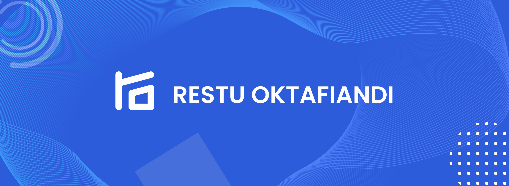

<h1>RESTU OKTAFIANDI</h1>

- 👋 Hi, I’m Restu Oktafiandi
- 👀 I’m interested in Web Developer
- 🌱 I’m currently learn NodeJS
- 📫 How to reach me <a href="restuoktafiandi1@gmail.com">restuoktafiandi1@gmail.com</a>

<h2>🛠 Languages and Tools</h2>

